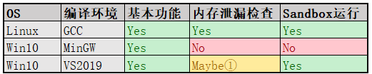

# 开发信息跟踪

## 功能支持情况

### mockcpp功能支持情况

|  OS    | 编译环境 | 对象虚方法mock | 函数mock | 重载函数mock | 对象非虚非静态方法mock |
|  ----  | ----     |         ----  |    ----  |   ----      |   ----                |
|Linux   | GCC      |  Yes          | Yes      |   Yes       |  Yes                  |
|Win10   | MinGW    |  Yes          | Yes      |   Yes       |  Yes                  |
|Win10   | VS2019   |  Yes          | No       |   Yes       |  Yes                  |

说明：
- 函数 mock
  - 包括 全局函数 和 对象静态方法
  - 用法：MOCKER(func)
  - 对应用例 TestApiHook TestStaticMemberMocker
- 对象虚方法 mock
  - 用法：MockObject(Interface) mocker; MOCK_METHOD(mocker, method)
- 重载函数 mock
  - 包括 重载全局函数、重载对象静态方法、重载对象虚方法
  - 用法(函数)： MOCKER((函数类型)func)
  - 用法(对象方法): MOCK_OVERLOAD_METHOD(mocker, int (CUT::*) (int), func)
  - 对应测试用例：TestOverloadMethodMocker
- 对象非虚非静态方法 mock (内部试验)
  - 目前只做理论验证，没有提供友好的接口给外部使用
  - 实际应用中，不推荐mock非虚方法，一般mock抽象的虚方法即可
  - 对应测试用例：TestNonvirtualMemberMocker

### testngpp功能支持情况

|OS|编译环境|基本功能|内存泄漏检查|Sandbox运行|
|:--|:--|:--|:--|:--|
|Linux|GCC|Yes|Yes|Yes|
|Win10|MinGW|Yes|No|No|
|Win10|VS2019|Yes|Maybe①|Yes|

说明:
- testngpp基本功能包括
  - 自动生成用例辅助cpp文件，用例管理，用例运行，生成执行结果报告
- testngpp高级功能说明
  - 内存泄漏检查(without -m)：执行用例时检查是否有内存泄漏情况
  - Sandbox执行(with -s): 每个用例在单独沙箱运行，多用于持续集成 
- 表格填写状态说明
  - Yes : 支持
  - No : 不支持
  - Maybe : 可能支持(运行工具测试中发现一些异常，但不能确定用户环境是否可用)
- 注释
  - ①: testngpp用例执行时，三个测试套件报内存泄漏(TestMemChecker,TestXMLBuilder,TestXMTestLListener).

## 测试用例执行情况

|  项目   |  OS   | 编译环境 | 用例执行(-m) | 用例执行 | 
|  ----   | ----  | ----  | ----  | ----  |
| mockcpp | Win10 | MinGW | All Pass | NA |
| testngpp| Win10 | MinGW | All Pass | NA |
| mockcpp | Win10 | VS2019 | Fail 2,Error 23 ① | Exception |
| testngpp| Win10 | VS2019 | All Pass | 3 Fixture Fail ② |

说明：
- 用例执行(-m) 表示执行用例时关闭内存检查。
- MinGW下的内存检查功能还未开通。
注释：
  - ① Format的两个用例Fail，ApiHook相关用例Error，VS2019可能对内存代码段进行了保护。
  - ② 三个测试套件报内存泄漏(TestMemChecker,TestXMLBuilder,TestXMTestLListener)

